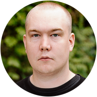

# About

This is the personal web page of Rasmus Källqvist, where I write about
Programming and Mathematics.

I'm currently working as a software developer at [Mojang Studios](https://www.minecraft.net/en-us),
where I get to write both C++ and JavaScript code for Minecraft: Bedrock Edition
as part of the Menu UI team.

I studied Embedded Systems at the Royal Insitute of Technology at Stockholm,
where I learnt C programming and electronics. Since then, I have found an
interest in the more theoretical sides of software development, with a bit of
functional programming, program language theory and mathematics.

In my spare time, I like to collect vinyl records, make music, read philosophy,
do rock climbing, and occasionally DJ.

You can also find me [on Twitter](https://twitter.com/RasmusKallqvist) and [on GitHub](https://github.com/Warwolt).
